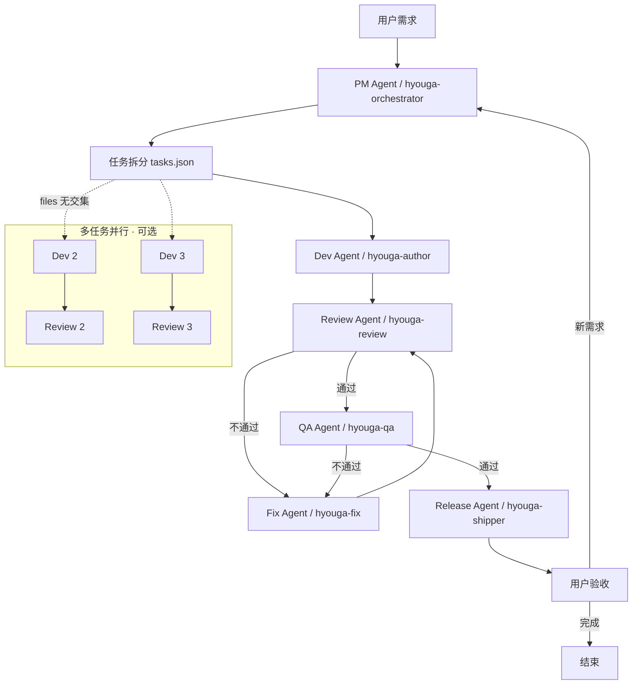

# Agent 流水线 · 多角色分工（标日 H5 · 合并版）

> 机器路由：[agent-pipeline.json](./agent-pipeline.json)  
> PM 任务模板：[pm-tasks-template.json](./pm-tasks-template.json) · 任务目录 [tasks/](./tasks/)  
> 文递自归：[Agent文递自归.md](./Agent文递自归.md) · [PROJECT_SPEC.md](../PROJECT_SPEC.md)

将通用「PM → Dev → Review → QA → Fix → Release」与仓库 **hyouga-* Skill** 合并为**一套**流水线，避免双轨打架。

---

## 一、角色映射表（你的命名 ↔ 本仓库）

| Agent 名称 | 类型 | 本仓库 Skill | 职责摘要 |
|------------|------|--------------|----------|
| **PM Agent** | 主 | `hyouga-orchestrator` | 解析需求、输出 `docs/tasks/*.json`、派单 |
| **Dev Agent** | 主 | `hyouga-author` | 编码；ICE L0–L4；标日 data/四关 |
| **Review Agent** | 主 | `hyouga-review` | 审查 = auditor **V1–V2**（pre-ship、日文、TTS） |
| **QA Agent** | 主 | `hyouga-qa` | 测试 = auditor **V3**（四关冒烟、公网探测） |
| **Fix Agent** | sub | `hyouga-fix` | 仅 FAIL 后 L1 修；修完回到 Review |
| **Release Agent** | sub | `hyouga-shipper` | R0–R3；changelog/链接；**push 须用户明说** |

兼容旧称：`hyouga-auditor` = Review + QA 合体；可说「auditor V3」= QA。

---

## 二、工作流（Mermaid · 与架构图一致）



**Fix 循环**：Review 或 QA 不通过 → Fix（最小 diff）→ 再 Review（必）→ 再 QA（发版前必）。

**用户验收后**：新需求/问题 → 回到 **PM**（更新 backlog 或新 `round-*.json`），文递自归：在 `confirmed` 上叠层，不整站重写。

---

## 三、各阶段说明（合并细则）

### 1. 需求解析与任务拆分（PM Agent）

| 项 | 内容 |
|----|------|
| 输入 | 用户自然语言 |
| 输出 | `docs/tasks/round-<date>-<slug>.json`（见 pm-tasks-template） |
| 行为 | 指定 `owner: hyouga-author`、ICE、files、acceptance；`parallel_ok` 仅当文件不交叉 |

### 2. 编码实现（Dev Agent）

- 遵循 `PROJECT_SPEC`、`项目知识库-标日日文书写.md`
- 只改任务单内 `files`；完成后 Handoff → Review

### 3. 代码审查（Review Agent）

- V1：`pre-ship-check.py`
- V2：日文 + TTS 对账（脚本内已含）
- **不改代码** → FAIL 列表交 Fix

### 4. 测试验证（QA Agent）

- 在 Review PASS 之后
- L14 四关 + 可选 16/18；公网是否已 push（WARN）
- 用例见 `docs/MVP收官-手机验收清单.md`

### 5. 修复循环（Fix Agent · sub）

- 只处理 Review/QA 的 FAIL 项
- L1 最小修复 → 强制再 Review

### 6. 发布准备（Release Agent · sub）

- R1：交付反馈块（默认）
- R2：用户说 push/upload
- bump cache 四处 + `同步作者链接.bat`

---

## 四、刻度速查

| 角色 | 刻度 |
|------|------|
| PM | O0–O3 |
| Dev | ICE L0–L4（见 Agent文递自归） |
| Review | V1–V2 |
| QA | V3 |
| Fix | L1 only |
| Release | R0–R3 |

---

## 五、Handoff 格式

```markdown
## Handoff · [pm|author|review|qa|fix|shipper] → 下一角色
- **scope** / **task_id**：
- **cache**：v=44
- **files** / **FAIL 项**：
- **commands_run**：
- **result**：PASS / FAIL
- **next**：hyouga-___ ，档位 ___
```

---

## 六、并行 Scale（24 课）

| 规则 | 说明 |
|------|------|
| 可并行 | 不同 `lessonId` 的数据文件（如 T1→第15课、T2→第17课） |
| 禁止并行 | 同改 `speech-engine.js`、`app.js`、`index.html` |
| 合并点 | 全部 Dev 完成后 **一次** Review V1 + QA V3 |

---

## 七、仓库资产绑定

| 资产 | 绑定角色 |
|------|----------|
| `pre-ship-check.py` | Review V1+、QA、Shipper |
| `iteration-baseline.json` | 全员 CONFIRM |
| `agent-delivery-gate.mdc` | Release |
| `wendi-zigui-core.mdc` | 全员 |

---

## 八、修订记录

| 日期 | 内容 |
|------|------|
| 2026-05-21 | 初版 hyouga 四角色 |
| 2026-05-21 | 合并 PM/Dev/Review/QA/Fix/Release 六角色 + Mermaid + pm-tasks |
