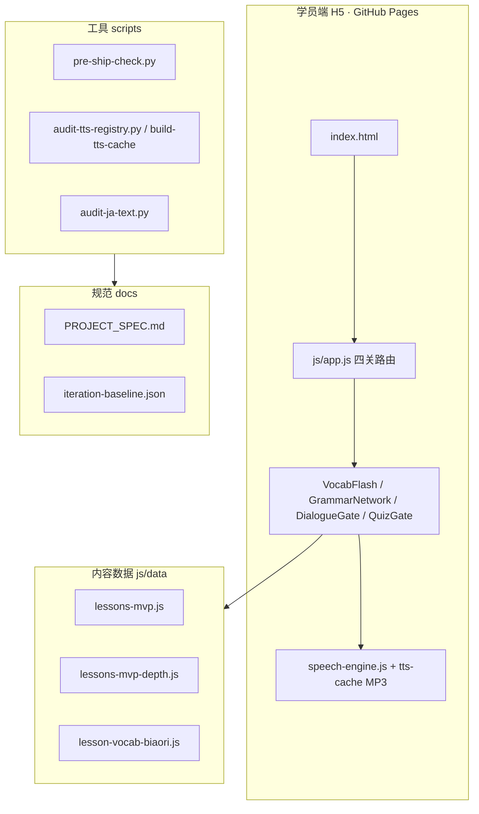

# 项目架构与归档规范

> 配合 [PROJECT_SPEC.md](../PROJECT_SPEC.md) · 当前 **MVP 三课**（14/16/18）· cache 以 `js/share-wechat.js` 的 `CACHE_VER` 为准。

---

## 1. 系统总览



**正式交付面**：仓库根目录 `index.html` + `js/` + `css/` + `tts-cache/`（微信转发 **HTTPS 公网**，非小程序运行时）。

**并行/遗留**（改 MVP 主线时勿混）：

| 路径 | 用途 |
|------|------|
| `japanese_learning_miniapp/` | 微信小程序（后续企业能力） |
| `手机微信版/` | 旧打包/说明 |
| `发布包/` | U 盘/离线包 |
| `legacy.html` | 历史页 |
| `【产品PRD】/` | 产品原文（只读参考） |

---

## 2. 目录职责（根目录）

| 路径 | 职责 |
|------|------|
| `index.html` | H5 入口；`?v=` 与 `CACHE_VER` 一致 |
| `share.html` | 分享落地页 |
| `js/app.js` | 课时驾驶舱、四关 Tab、进度 `mvp-storage` |
| `js/vocab-flash.js` | ① 単語 |
| `js/grammar-network.js` | ② 文法 |
| `js/dialogue-gate.js` + `shadow-speak.js` | ③ 会話 + 跟读评分 |
| `js/quiz-gate.js` | ④ テスト |
| `js/speech-engine.js` | TTS/录音/评分（改动必四关回归） |
| `js/sensei-tip-card.js` | 先生のひとこと 统一卡片 |
| `js/data/` | **课程内容唯一源**（见 §3） |
| `tts-cache/` | MP3；key = `ttsCacheKey(日文行)` |
| `docs/tts-registry.json` | 语音编号清单（脚本生成） |
| `scripts/` | 审计、发布、本地服务 |
| `docs/` | 知识库、工作流、版本史 |
| `.cursor/rules/` | Cursor Agent 规则（`alwaysApply` 核心 2～3 条） |

**根目录 `.bat`**：作者本机操作（`打开本地预览.bat`、`发布前自检.bat`、`帮你发布好了.bat` 等），命名保持中文直观，不在代码中硬编码列表。

---

## 3. 内容数据命名与扩展

### 3.1 课次 ID

- 类型：**数字标日课次** `lessonId: 14 | 16 | 18 | …`
- MVP：`js/data/lessons-mvp.js` → `LESSONS_MVP[]`
- 深度补丁：`js/data/lessons-mvp-depth.js` → `LESSON_DEPTH_PATCH[lessonId]`
- 标日生词：`js/data/lesson-vocab-biaori.js` → `LESSON_VOCAB_BIAORI[lessonId]`

### 3.2 字段命名（中文隔离）

| 用途 | 字段 |
|------|------|
| 界面日文 | `jp` / `text` / `question` / 文型行 |
| 中文释义/灰字 | `meaningZh` / `zh` / `explanationZh` / `text.zh` |
| 朗读 | `ttsLine` / `questionTts` / `kana`；喇叭 `data-tts-key` |
| 先生卡片 | `lessonCoachSummary` · `nodePatches` |

### 3.3 四关与 gate 下标

| 下标 | Tab | 模块 |
|------|-----|------|
| 0 | 単語 | `VocabFlash` |
| 1 | 文法 | `GrammarNetwork` |
| 2 | 会話 | `DialogueGate` |
| 3 | テスト | `QuizGate` |

状态：`mvp-storage.js` → `state.lessons[lessonId].gate1..gate3`（gate2=会話，与 Tab 序号不同，**禁止改号除非全库迁移**）。

---

## 4. TTS 与缓存文件命名

- **MP3 文件名**：`tts-cache/{ttsCacheKey}.mp3`（通常为 8 位 hex，由 `speech-engine.js` 与 `scripts/tts_lib.py` 一致算法）
- **清单**：`docs/tts-registry.json`（`seq` / `key` / `line` / `lessonId`）
- **规范**：[TTS-语音包编号规范.md](./TTS-语音包编号规范.md)

---

## 5. 文档归档分层

| 层级 | 放什么 | 示例 |
|------|--------|------|
| L0 入口 | 一眼导航 | `PROJECT_SPEC.md` · `AGENTS.md` · `README.md` |
| L1 工作流 | 怎么交付/迭代 | `Agent交付前工作流.md` · `Agent文递自归.md` |
| L2 知识库 | 领域标准 | `项目知识库-标日日文书写.md` · `项目知识库-文递自归.md` |
| L3 机器可读 | 版本/基线 | `version-history.json` · `iteration-baseline.json` |
| L4 操作说明 | 单次发布/微信 | `发布前自检.md` · `发布与知识库同步.md` |
| L5 历史/冻结 | 不再改正文 | `VERSION-WECHAT-v1.md` · 未来 `docs/archive/` |

**禁止**：在 `README.md` 写死过期 `?v=`；以 `CACHE_VER` / `version-history.json` 为准。

---

## 6. 归档约定（完整版启动前）

| 场景 | 做法 |
|------|------|
| MVP 冻结快照 | `docs/archive/mvp-3lessons-YYYYMMDD/` 放说明 + 当时 `cache` 号（可选 tag） |
| 废弃脚本/页 | 移入 `archive/` 或根目录 `legacy.html`，README 标明「勿用于学员链接」 |
| Agent 过程文件 | 根目录 `_*.py` / `_*.js`（除 `_redirects`）、`audit-ja-out.txt`、`*副本*.html`、冗余 `*.zip` → 删除；见 `.gitignore` |
| PRD/讨论 txt | 保留在 `【产品PRD】/`，**不**作为代码依赖 |
| 重复 TTS 说明 | 仅维护 `docs/TTS-语音包说明.md`（根目录 `docs/TTS-语音包说明.md` 若重复则合并后删一份——待作者确认） |

---

## 7. 24 课扩展清单

启动新课次前，按课循环：

1. [ ] `lessons-mvp.js` 增加 `lessonId` 条目（会話/文法骨架）
2. [ ] `lessons-mvp-depth.js` 增加 `LESSON_DEPTH_PATCH[id]`（秘技/zh/quizReplace）
3. [ ] `lesson-vocab-biaori.js` 生词表
4. [ ] `python scripts/audit-ja-text.py`
5. [ ] 生成 TTS + `audit-tts-registry.py --write` → 缺失 0
6. [ ] 本地四关冒烟（建议课 14 为回归基准课）
7. [ ] `iteration-baseline.json` 追加 `confirmed` 条目
8. [ ] bump `CACHE_VER` 四处同步（见 PROJECT_SPEC §5）
9. [ ] `pre-ship-check.py` 全绿再交付链接

**课次规模粗算**：24 课 × 四关 × TTS 行数 → `tts-cache` 体积显著增大，发布前确认 GitHub Pages 体积与首屏加载策略（可后续做按课懒加载，**非 MVP 范围**）。

---

## 8. 工作流一览

```
作者改内容 → CONFIRM(C 读 baseline) → 改 data/js → 本地预览 ?v=
         → pre-ship-check.py → 交付反馈块 →（用户要求）git push → Pages
```

| 脚本/命令 | 何时 |
|-----------|------|
| `发布前自检.bat` | 每次声称可发布 |
| `打开双通道预览.bat` | **日常改 UI 前置 + 交付前终检**（浏览器 + 390×844 真机框） |
| `打开本地预览.bat` | 通道 A · 浏览器全宽 |
| `打开小程序Cursor预览.bat` | 通道 B · 小程序真机框 |
| `重启本地服务.bat` | ERR_EMPTY_RESPONSE |
| `批量检查语音包.bat` | 改 TTS 文案后 |
| `帮你发布好了.bat` | push 后验收公网 |

---

## 9. 修订记录

| 日期 | 内容 |
|------|------|
| 2026-05-21 | MVP 架构图、目录职责、命名、归档、24 课清单 |
