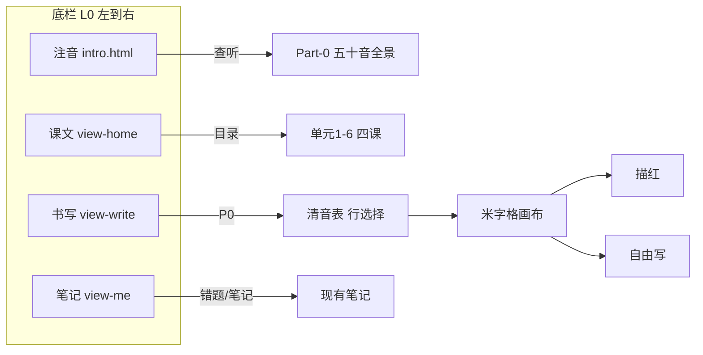

# 书写板块 · 讨论稿 v1（先拍板再写码）

> **日期**：2026-05-29  
> **状态**：已拍板 · **已开工**（v333：四栏 + `#view-write` + L0 Canvas）  
> **锁定基线**：课文/笔记/注音/语音 v332 已 push v2；本板块 **不改动** U1L1–4 五关与课内金星公式。

---

## 1. 我们理解（你的原话对齐）

| 项 | 理解 |
|----|------|
| 底栏 | 由 3 个增至 **4 个**：**注音 → 课文 → 书写 → 笔记**（左→右） |
| 现阶段 | **先锁定成果**，再单开「书写」；**第一刀只做五十音书写**（平/片假名） |
| 参考交互 | 中国毛笔字 **米字格** + 屏上 **描红/跟写** + **空白区自由写**（热熔笔/触控笔手感，非毛笔特效） |
| 复杂度 | L1–L24 单词/听写 **暂缓**；PRD 四层递进保留为路线图 |
| 美工 | 需一版 **静态线框 + 视觉样张**，服从 INTEPOINT 全景 + `DESIGN-L0` + 会议纪要范式 |

---

## 2. 与现有产品文档的对齐（必拍板）

### 2.1 金星 / 四关 · 书写关系

| 文档 | 说法 | 建议统一口径 |
|------|------|----------------|
| `docs/我们-产品愿景-学习の道.md` | **写** 不计入三星、不进大礼包 | ✅ **维持**（书写 = 课外巩固） |
| `书写板块/书写板块PRD.txt` | 书写纳入课程总进度、第四关 | ⚠️ **修订 PRD**：书写 **独立进度**，与 `gate0–4` **脱钩** |

**建议**：书写板块有 **自己的完成度**（如「清音 46/46」），**不**改海星、不锁课。

### 2.2 注音 vs 书写

| 板块 | 职责 | 入口 |
|------|------|------|
| **注音** | 查、听、认（リファレンス） | 继续 `intro.html`（Part-0 全景） |
| **书写** | 写、描、练（产出） | 新建 `index` 内 `#view-write` 或 `write.html`（建议 **内嵌 view**，底栏不切页丢状态） |

避免与入門 **抢 Tab**：入門仍是「认+听」；书写是「写」。

### 2.3 底栏图例（L0）

更新 `docs/DESIGN-L0-图标与人设全景.md` §1 为 **四格**（待你确认后改真源）：

| 序 | 语义 | 图标建议 | 文案 |
|----|------|----------|------|
| 1 | 注音查阅 | 方框 + **あ**（沿用） | 注音 |
| 2 | 课文目录 | 书本（沿用） | 课文 |
| 3 | 书写练习 | **笔 / 米字格** 线性 24px | 书写 |
| 4 | 笔记复习 | 人形（沿用） | 笔记 |

---

## 3. `书写板块/` 文件夹 · 现状与建议增补

### 3.1 已有

| 文件 | 说明 |
|------|------|
| `书写板块PRD.txt` | 四层 L0–L3 全量 PRD（偏长期）；需拆 **P0 子集** |

### 3.2 建议本阶段新增（讨论定稿后再落文件）

```text
书写板块/
├── 00-讨论稿-四栏与L0范围-v1.md     ← 本文件
├── 美工第一版-L0五十音书写-提示词提纲.md
├── P0-L0-范围锁定.md                 ← 拍板后：仅清音+ん、交互清单
├── data/
│   ├── kana-write-manifest.json      ← 46+ん 列表、行段、对应 intro 节点 id
│   └── strokes/                      ← 每假名 SVG 笔顺路径（待素材）
├── mock/
│   └── write-l0-preview.html         ← 静态/HTML 可点原型（工程+美工共用）
└── assets/
    ├── grid-mizige.svg               ← 米字格底图（浅灰虚线）
    └── sample-あ-trace.svg           ← 描红样例
```

### 3.3 还缺什么（内容 / 素材）

| 类别 | 缺什么 | 谁提供 | P0 是否必需 |
|------|--------|--------|-------------|
| **数据** | 46+ん 与 `intro-content` / `intro-kana-tips` 的 **id 对照表** | 工程从现有 js 导出 | ✅ |
| **笔顺** | 每假名 **笔画 SVG 路径**（动画可二期） | 美工/字库或采购开源 | P0 可 **仅描红轮廓** 无动画 |
| **底字** | 描红用 **灰色模板字**（ひらがな / カタカナ 两态） | 美工 TTF 转路径或 PNG mask | ✅ |
| **评分** | 笔迹 vs 模板 的简单重合度算法说明 | 工程 | P0 可 **「提交=完成」** 无自动评分 |
| **音频** | 🔊 单音 | **复用** 入門 TTS / `tts-cache` | ✅ 已有 |
| **进度** | `localStorage` 字段：`write.kana.seion[]` | 工程 | ✅ 简单勾选即可 |

---

## 4. 信息架构 · 四栏与 L0 书写（第一版）



### 4.1 L0 屏结构（P0 · 单屏流程）

1. **入口**：底栏「书写」→ 默认 **清音表**（与入門 `intro_seion` 同序：あ行…わ行 + ん）
2. **选字**：点一格（如 さ）→ 进入 **书写页**
3. **书写页布局**（390×844 真机框）  
   - 顶：← 返回 · **さ · 清音** · 🔊  
   - 中：**一个大米字格**（≈ 72–80% 屏宽，正方形）  
     - 层1：米字格虚线  
     - 层2：描红底字（可开关）  
     - 层3：Canvas 笔迹（手指/笔）  
   - 下：**描红 | 自由写** 切换 · **清除** · **完成**  
4. **完成**：标记该字「已练」→ 回表；**不**弹复杂星级（P0 可 ✓ 勾）

### 4.2 与标日 / 单元的关联（P0 弱关联 · P1 强关联）

| 阶段 | 关联方式 |
|------|----------|
| **P0** | 仅对齐 **入門清音表** + 文案「学完入門再来练写」；**不**按第 N 课解锁 |
| **P1** | 第 1–4 单元 · 当课 **5 词书写**（PRD L1） |
| **P2** | 第 5–12 课词 + 汉字笔顺 |
| **P3** | 第 13–24 短句听写 |

梯次难度：**笔画数 ↑ → 浊音/拗音 → 单词 → 句子**，与 PRD 一致，但 **工程分期**。

---

## 5. 技术草案（供讨论，确认后写码）

| 项 | 方案 |
|----|------|
| 画布 | H5 `canvas` + Pointer Events（微信 WebView 兼容） |
| 格线 | CSS 背景 `grid-mizige.svg` 或 canvas 画线 |
| 笔触 | `lineCap round` · 默认 2.5–4px · 深灰 `#37474F`（非毛笔滤镜） |
| 存储 | `mvp-storage` 扩展 `state.write.kana` |
| 路由 | `app.js` 增加 `view-write`；底栏 4 `data-view` |
| 发版 | 独立 `?v=` bump；**不动** 冻结课数据 |

---

## 6. 待你拍板（确认后再开工）

1. **底栏顺序**：是否固定 **注音 | 课文 | 书写 | 笔记**？  
2. **书写入口**：`index` 内 `#view-write`（推荐）还是独立 `write.html`？  
3. **P0 范围**：是否同意 **仅清音 46 + ん**，浊音/拗音 **二期**？  
4. **评分**：P0 是否 **无自动评分**（写完点完成即可），评分引擎 **二期**？  
5. **与三星**：确认书写 **永不** 影响课内海星？  
6. **PRD 修订**：是否同意把「第四关 / 纳入 gate」改为 **独立板块**？

---

## 7. 确认后 · 拟做（工程清单）

1. 更新 `DESIGN-L0` + `nav-icons.js`（`write` 图标）+ `index.html` 四栏  
2. `mock/write-l0-preview.html` + `书写板块/data/kana-write-manifest.json`  
3. `js/write-kana-l0.js` + `css/write-l0.css`（最小可写可清）  
4. 跑 `发布前自检` · **不**改 `lessons-mvp` 冻结课  
5. 美工按 `美工第一版-L0五十音书写-提示词提纲.md` 出 **1 张主屏 + 1 张书写页** 静态稿

---

## 8. 关联文档

- `书写板块/书写板块PRD.txt`  
- `docs/我们-产品愿景-学习の道.md` §3.2（写不计星）  
- `docs/DESIGN-L0-图标与人设全景.md`  
- `过程讨论内容/11-五十音INTEPOINT全景模型启发.md` · D6 文字系统  
- `docs/Part-0-播种检查表.md` · `intro_seion` 表结构  
- `docs/APP-COMPARISON-标日App对比.md` §假名书写  
